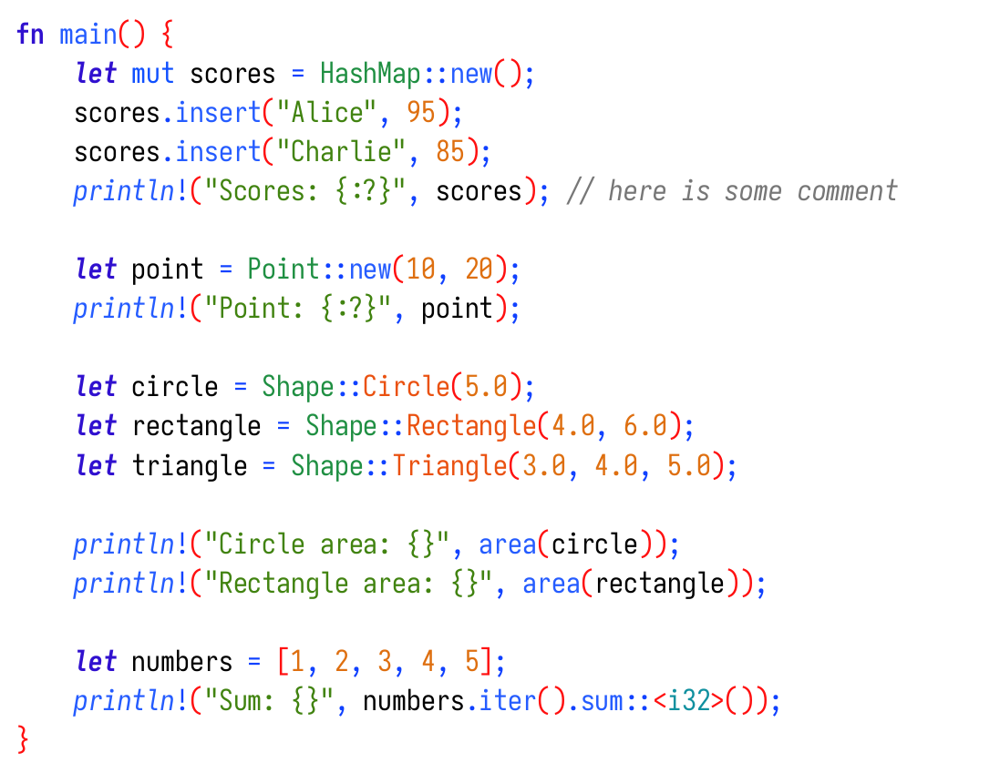
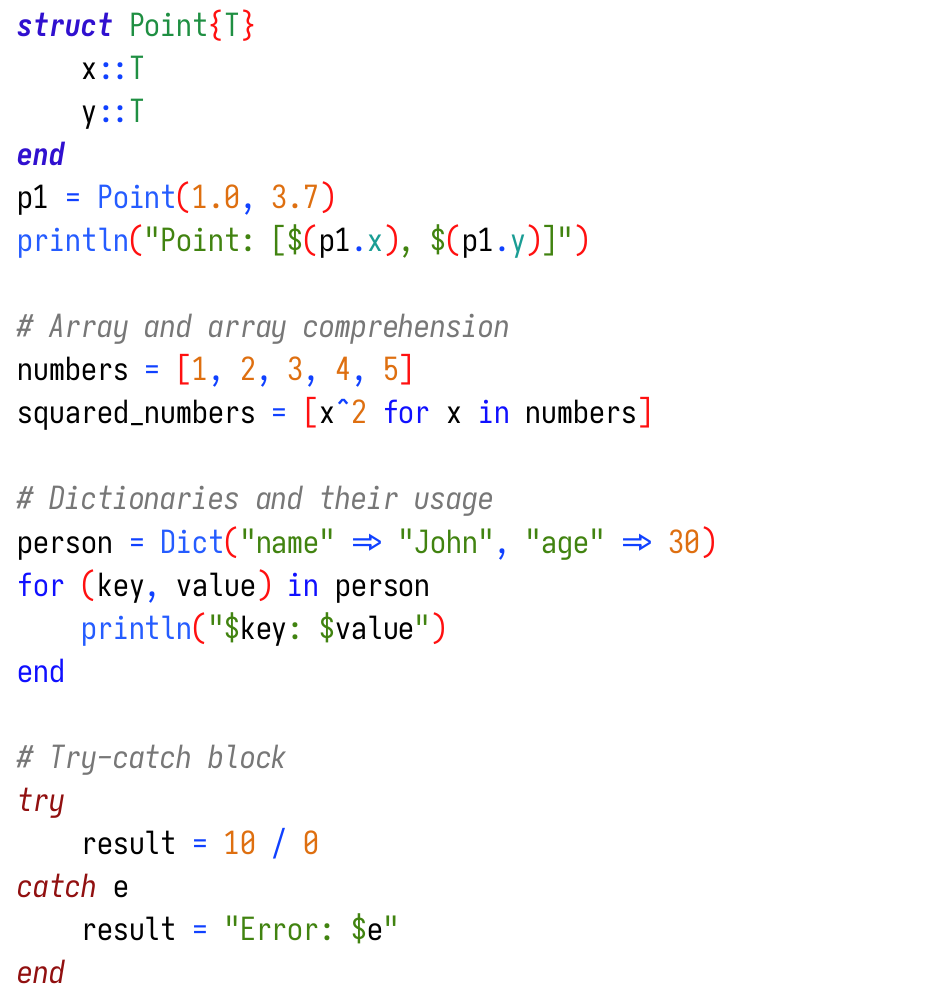

# What is this?

This is a CLI tool that consumes [`TreeSitter`](https://tree-sitter.github.io/tree-sitter/)'s output and transforms it into LaTeX code that will produce syntax-colored code listing.

If you are familiar with LaTeX packages like [`minted`](https://ctan.org/pkg/minted?lang=en) or [`listings`](https://ctan.org/pkg/listings), this could be seen as an alternative.

## Example snippets:
_Note that the colors and styles can be individually customized in configuration file._

Rust example snippet:  

Julia example snippet:  

# How to use it?
### External requirements:
1. **TreeSitter installed**

    On Linux, it is `tree-sitter-cli` package.   
    On Windows, it is `tree-sitter.exe`.

    You can check if the installation is successfull by running `tree-sitter` command.
    It should print help. 

2. **Parsers for languages downloaded**
    
    TreeSitter has [parsers for many languages](https://tree-sitter.github.io/tree-sitter/#parsers), you will need to download the ones you want and put them in a directory that will be specified in TreeSitter's configuration. 
    More on that later.

3. **LaTeX setup**

    In your LaTeX preamble, you will need to add `\usepackage{listings}`.
    The `listings` package provides captions, labels and referencing as well as other formatting (line numbers, frame, ...). 

### First run:

If you never ran `tree-sitter` on your machine before, it will want you to initialize it.
That is done simply by running `tree-sitter init-config` and it will create a configuration file and tell you where to find it.

### Actual usage of `chromacode`
You can download pre-build binary `chromacode[.exe]` from [here](https://github.com/TomLebeda/chroma_code/releases) or you can clone this repo and build it yourself by running `cargo build --release` (assuming you have [Rust and Cargo installed and set up](https://rustup.rs/)). 

Once you have the initial setup done, you can just call `chromacode` and follow the instructions. 
Or, if you prefer classic CLI, you can call `chromacode -h`, read the help page and use it in non-interactive mode (or even in hybrid mode). 

The general idea is that you will feed it a file with some source code and it will spit out a `.tex` file that is ready to be used in your LaTeX code (by `\input{}` command).
Note that the package `listings` will be required in LaTeX since it provides labels, line numbering, frame and other goodness. 

# Configuration

_For more detailed information, please refer to the [official TreeSitter documentation](https://tree-sitter.github.io/tree-sitter/syntax-highlighting)_

After running `tree-sitter init-config`, TreeSitter will create a configuration file `config.json`.

### Paths and parsers
In the `config.json` file, there is an option `parser-directories` that determines where will TreeSitter look for the language parsers.
When you download some language parser, the directory `tree-sitter-[language]` should be located in those paths.

### Theme (colors and styles)
Second option in the `config.json` file is `theme`. 
TreeSitter will use those values for highlighting.

There will be probably some default values, but I recommend using the example I provided [here](examples/config-example.json) as an template to build upon. 
It contains more capture groups and has unified format. 

### Highlight queries
Highlighting queries are patterns that tell TreeSitter what pieces of code have what syntactic meaning.
Most of the language parsers provide some highlighting queries located usually in `tree-sitter-language/queries/highlights.scm`. 

Those queries usually work fine out of the box, but aren't as rich as could be. 

I use custom highlighting queries that are available in this repo in `examples` directory ([here](examples)).
They are pretty much taken from [`nvim-treesitter`](https://github.com/nvim-treesitter/nvim-treesitter) repository and modified to function properly without the Neovim abstractions.
To make the nvim-treesitter's queries work, following modifications were made:

1. **replace unsupported predicates**  
The `nvim-treesitter` uses some predicates that are not supported by the tree-sitter-cli.   
Most common are:

    - `#lua-match?` - I replaced it with regular `#match?`, but don't forget to replace the regex as well, Lua has some additional regex special characters such as `%u` or `%s`.
    - `#any-of?` - I expanded this one into many `#match?` patterns for each individual case, but there may be some better way to deal with it.

2. **Reorganize the scheme captures**  
The `nvim-treesitter` does something smart when multiple captures are applicable at the same time, but the regular `tree-sitter` does not. From my experimentation, the first match is returned. Therefore, the more specific captures need to be in the file before the more generic ones. This may require some trial and error, but getting the longer ones as first is a good place to start.

Feel free to use my highlights as an inspiration.
Also note that the file needs to be named `highlights.scm`, the files in this repository are intentionally named differently.

# How does `chromacode` differ from `minted`?

The end goal is the same: to have pretty colored code listings in LaTeX. But the path is slightly different.

Here are the main differences:

1. It uses TreeSitter to handle the syntax highlighting. 
The results are in my opinion better-looking, more rich and precise. 
See the example snippets above or the [full example pdf](examples/example_full.pdf) and form your own opinion.

2. This isn't a LaTeX package, but rather a tool that will generate LaTeX code. 
That means it will produce `.tex` file and it is not necessary to run it on every LaTeX compilation. 
If that is something positive or negative is up to you.
